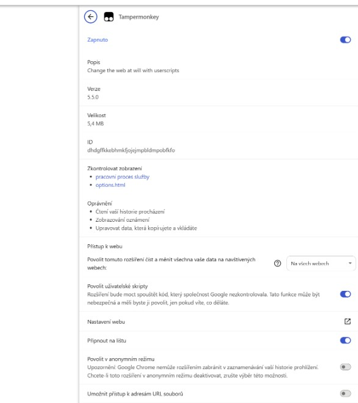
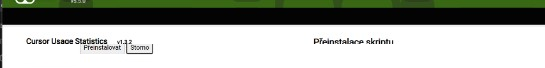
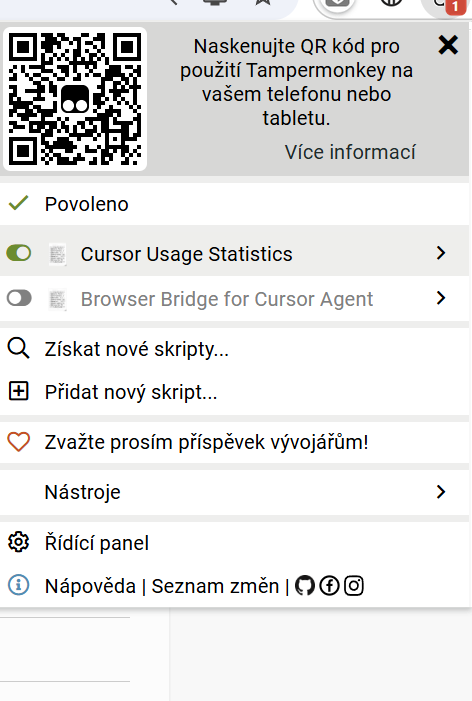

# Jak nainstalovat Tampermonkey v Chrome

Stručný návod pro Chrome: oficiální Tampermonkey → potřebná oprávnění → instalace skriptů z tohoto repozitáře.

## 1. Nainstalujte Tampermonkey

1. Otevřete oficiální stránku rozšíření v [Chrome Web Store](https://chromewebstore.google.com/detail/tampermonkey/dhdgffkkebhmkfjojejmpbldmpobfkfo?hl=cs&utm_source=ext_sidebar).
2. Ověřte, že jde o **Tampermonkey** (ikona s „očima“, vydavatel `tampermonkey.net`).
3. Klikněte na **Přidat do Chromu** a potvrďte instalaci.

Pokud už máte rozšíření nainstalované, tlačítko může místo toho říkat **Odstranit z Chromu** — to je v pořádku, pokračujte krokem 2.

## 2. Zkontrolujte, že je rozšíření zapnuté

1. V Chrome otevřete `chrome://extensions/` (nebo: nabídka ⋮ → **Rozšíření** → **Správa rozšíření**).
2. U Tampermonkey musí být přepínač **Zapnuto**.
3. Doporučení: zapněte **Připnout na lištu**, ať ikonu snadno najdete.

Ikona Tampermonkey by měla být vidět vpravo nahoře vedle adresního řádku.

## 3. Povolte uživatelské skripty a přístup k webům

V Chrome od novějších verzí nestačí jen nainstalovat Tampermonkey — je potřeba explicitně povolit spouštění userscriptů.

1. Na `chrome://extensions/` klikněte u Tampermonkey na **Podrobnosti** (nebo ikonu → **Správa rozšíření**).
2. Zapněte **Povolit uživatelské skripty**. Bez toho se skripty nespustí.
3. U **Přístup k webu** nastavte oprávnění jen tak široké, jak potřebujete:
   - **Na konkrétních webech** — ideální, pokud používáte jeden skript na jedné doméně.
   - **Na všech webech** — praktické, pokud máte více skriptů na různých doménách (nejjednodušší volba pro celý tento repozitář).
   - Volby typu anonymní režim nebo přístup k `file://` obvykle **nepotřebujete**.

## 4. Nainstalujte userscript z tohoto repozitáře

1. Otevřete [README](README.md) a v tabulce **Installation** klikněte na **Install** u požadovaného skriptu.
2. Chrome otevře stránku `.user.js` a Tampermonkey zobrazí instalační dialog.
3. Zkontrolujte název, popis a `@match` (na kterých URL skript běží).
4. Potvrďte tlačítkem **Instalovat** (případně **Přeinstalovat** / aktualizace).

Pokud prohlížeč přímou instalaci zablokuje, v Tampermonkey použijte **Nastavení → Import from URL** a vložte stejnou raw URL z README.

### Aktualizace / přeinstalace

- Při nové verzi znovu klikněte na **Install** v README — Tampermonkey nabídne aktualizaci nebo přeinstalaci.
- Po přeinstalaci mohou být lokální nastavení skriptu resetována (Tampermonkey na to upozorní).

## 5. Ověření, že skript běží

1. Otevřete stránku, která odpovídá `@match` skriptu (např. dashboard Cursoru, BookKit, JIRA…).
2. Klikněte na ikonu Tampermonkey.
3. Mělo by být vidět **Povoleno** a u daného skriptu zapnutý přepínač.

Tampermonkey aktivní skript pozná také podle číselného **badge** u své ikony v liště Chrome. Například badge `1` znamená, že pro právě otevřenou stránku běží jeden userscript.

## Když se skript nespustí

Zkontrolujte postupně:

| Kontrola             | Co ověřit                                                            |
| -------------------- | -------------------------------------------------------------------- |
| Tampermonkey zapnutý | `chrome://extensions/` → **Zapnuto**                                 |
| Userscript zapnutý   | popup Tampermonkey → přepínač u skriptu je zelený                    |
| Uživatelské skripty  | v podrobnostech rozšíření je zapnuté **Povolit uživatelské skripty** |
| Přístup k webu       | Tampermonkey smí číst/měnit data na dané doméně                      |
| Správná URL          | adresa stránky odpovídá `@match` skriptu                             |
| Reload               | po instalaci nebo změně oprávnění obnovte stránku (`F5` / Ctrl+R)    |

Pořád nic? Otevřete znovu **Install** z README a ověřte, že je nainstalovaná aktuální verze.
