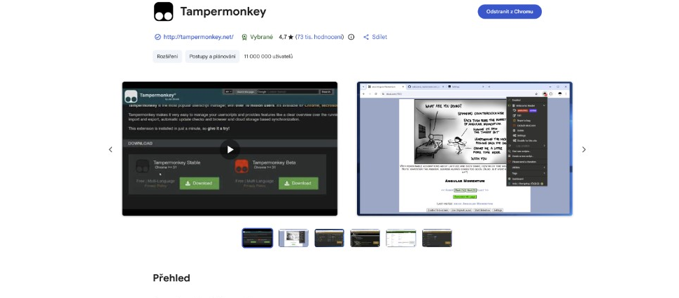

# GreaseMonkey scripts

Small Tampermonkey helpers I use every day — Cursor usage KPIs, BookKit fulltext search, Message Registry previews, uuIdentity login fixes, and more.

Want to try them? Use at your own risk.

**Disclaimer** — these scripts are usually generated with ChatGPT and tested only for my personal purposes.

## Installation

**New to Chrome + Tampermonkey?** Read the short Czech setup guide first:

**[Jak nainstalovat Tampermonkey v Chrome →](HOW-TO-INSTALL-TAMPERMONKEY.md)**

Click an **Install** link below. Tampermonkey should open the install or update prompt directly.

If direct install is blocked by the browser, use the same URL in the addon page:

- Settings (Nastaveni)
- Import from URL

| Addon                                           | Address                                                                                                                               |
| ----------------------------------------------- | ------------------------------------------------------------------------------------------------------------------------------------- |
| Copy uuBml as PNG to clipboard                  | [Install](https://raw.githubusercontent.com/sedlacl/GreaseMonkey/refs/heads/main/uubml-copy-as-png.user.js)                           |
| Cursor Usage Statistics                         | [Install](https://raw.githubusercontent.com/sedlacl/GreaseMonkey/refs/heads/main/cursor-usage-statistics.user.js)                     |
| uuBookKit Fulltext Search                       | [Install](https://raw.githubusercontent.com/sedlacl/GreaseMonkey/refs/heads/main/bookkit-fulltext-search.user.js)                     |
| Autoclose authentication page                   | [Install](https://raw.githubusercontent.com/sedlacl/GreaseMonkey/refs/heads/main/close-auth-page.user.js)                             |
| Identity login password manager bridge          | [Install](https://raw.githubusercontent.com/sedlacl/GreaseMonkey/refs/heads/main/identity-login-password-manager.user.js)             |
| JSONATA JAVA Checker                            | [Install](https://raw.githubusercontent.com/sedlacl/GreaseMonkey/refs/heads/main/jsonata-java-checker.user.js)                        |
| IndSoft JIRA - ManiTime copy tag                | [Install](https://raw.githubusercontent.com/sedlacl/GreaseMonkey/refs/heads/main/indsoft-jira-manictime.user.js)                      |
| Message Registry - Auto refresh                 | [Install](https://raw.githubusercontent.com/sedlacl/GreaseMonkey/refs/heads/main/message-registry-autorefresh.user.js)                |
| Message Registry - Preview downloads            | [Install](https://raw.githubusercontent.com/sedlacl/GreaseMonkey/refs/heads/main/message-registry-preview-downloads.user.js)          |
| Message Registry - Preview downloads (UUCloud1) | [Install](https://raw.githubusercontent.com/sedlacl/GreaseMonkey/refs/heads/main/message-registry-preview-downloads.uucloud1.user.js) |

## Notes

Use `Message Registry - Preview downloads` for the standard `uu-energygateway-messageregistryg01` UI.

Use `Message Registry - Preview downloads (UUCloud1)` for the `usy-idsmari-messageregistryg01` / IDS Apps variant. This version keeps the same preview dialogs and formatting tools, but adds compatibility fixes for older UU5 rendering, attachment button placement, and authenticated preview requests.

Use `Identity login password manager bridge` on uuIdentity login pages where password managers do not recognize the original `accessCode1` / `accessCode2` fields. The script decorates the native fields and inserts two compatible proxy password inputs that mirror back into the original form.

Use `Cursor Usage Statistics` on the Cursor usage dashboard to see spend KPIs (today, last 7 days, calendar month, daily average), a stacked chart of the top five models by spend plus others, and a per-model cost table. Toggle the chart between 7 or 30 days and tokens or spend; click a model in the table to filter it in the chart. Tooltips show daily and per-segment details. Included usage remains visible in token totals but counts as $0 spend, matching Cursor's own table.

Use `uuBookKit Fulltext Search` in `uu-bookkit-maing01` books where the built-in search is too limited. The script adds its own cached fulltext index over BookKit JSON commands, remembers known books, and lets you search previously indexed books from one dialog.

## Changelog

Per-script version history: **[changelogs.md](changelogs.md)**

Repo milestones (legacy):

- 1.0 - initial version
- 1.1 - fix of block element text
- 1.2 - add message detail download preview userscript
- 1.3 - add preview format button for JSON and XML payloads
- 1.4 - add message registry auto refresh userscript
- 1.5 - add UUCloud1-specific message registry preview downloads variant
- 1.6 - add uuIdentity login password manager bridge
- 1.7 - add uuBookKit fulltext search userscript
